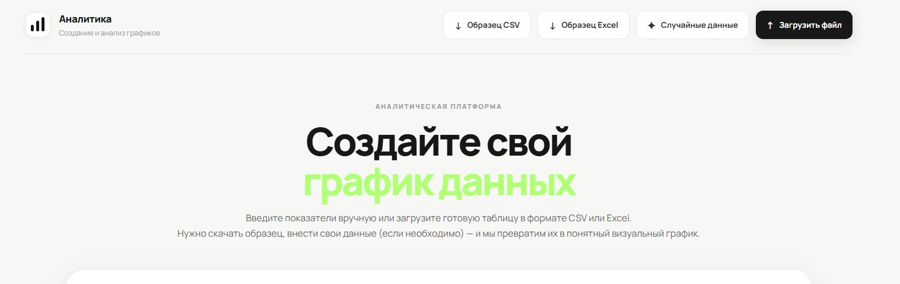

# Series — мультирядный time-series дашборд

Адрес: http://46.173.29.174/
Тестовое задание: сервис для ввода и визуализации до четырёх временных рядов
одновременно на одном графике, каждый — со своим типом отображения (**area /
spline / line / bar**) и собственным тултипом в стиле референса ниже: белая
карточка, дата жирным заголовком, цветная точка + название + значение
жирным по каждому ряду.



Данные можно:

- ввести вручную в таблице прямо в интерфейсе;
- загрузить из **CSV** или **Excel** (.xlsx/.xls);
- сгенерировать одной кнопкой **«Случайные данные»**.

---

## Стек технологий

| Слой         | Технологии |
|--------------|------------|
| Backend      | Python 3.12, Django 5, Django REST Framework, Gunicorn |
| База данных  | PostgreSQL 16 (SQLite — для локальной разработки без Docker) |
| Импорт файлов| pandas, openpyxl (парсинг CSV/XLSX) |
| Frontend     | React 18, Vite, ECharts 5 (SVG-рендер) |
| Инфраструктура | Docker, docker-compose, Nginx (раздача статики фронтенда + прокси на API) |

Почему так:

- **DRF** — стандарт для REST API на Django, минимум boilerplate для CRUD и загрузки файлов.
- **PostgreSQL** в Docker-окружении — реалистичная прод-конфигурация; SQLite оставлен для быстрого локального старта без БД.
- **ECharts** — единственная библиотека, которая «из коробки» умеет совмещать area/line(smooth)/line/bar на одном холсте с независимыми осями Y и даёт полный контроль над HTML тултипа (нужно было точно повторить стиль референса).
- **Vite** — быстрый dev-сервер и сборка фронтенда, прокси `/api` на Django в dev-режиме.
- **Nginx** в отдельном контейнере — отдаёт собранный фронтенд и проксирует `/api/` и `/admin/` на backend-контейнер, чтобы в проде фронт и API жили за одним портом.

---

## Локальная разработка без Docker

### Backend

```bash
cd backend
python -m venv .venv && source .venv/bin/activate   # Windows: .venv\Scripts\activate
pip install -r requirements.txt
cp .env.example .env
python manage.py migrate
python manage.py runserver 8000
```

По умолчанию (`.env.example`) backend работает на SQLite — база `db.sqlite3`
создастся автоматически.

### Frontend

```bash
cd frontend
npm install
npm run dev
```

Откройте http://localhost:5173 — Vite сам проксирует запросы `/api/*` на
`http://localhost:8000` (см. `vite.config.js`).

---

## API

Базовый префикс: `/api/`

| Метод | Путь                      | Описание |
|-------|---------------------------|----------|
| GET   | `/datasets/`               | Список сохранённых датасетов |
| GET   | `/datasets/<id>/`           | Датасет со всеми сериями и точками |
| POST  | `/datasets/manual/`         | Создать датасет из JSON (ручной ввод) |
| POST  | `/datasets/random/`         | Сгенерировать случайный датасет из 4 серий. Тело: `{"days": 14}` |
| POST  | `/datasets/upload/`         | Загрузить CSV/Excel, `multipart/form-data`, поле `file` |

### Формат ручного создания (`POST /datasets/manual/`)

```json
{
  "name": "My dataset",
  "series": [
    {
      "name": "Cost",
      "type": "area",
      "color": "#F2D675",
      "unit": "",
      "points": [
        { "date": "2026-06-01", "value": 20.5 },
        { "date": "2026-06-02", "value": 25.1 }
      ]
    }
  ]
}
```

`type` — один из `area | spline | line | bar`. От 1 до 4 серий в датасете.

### Формат файла для `/datasets/upload/`

«Широкая» таблица: первая колонка — дата, следующие до четырёх колонок —
значения серий (по порядку получают типы `area → spline → line → bar`,
если не переданы явно в поле формы `series_types` как `"area,spline,line,bar"`).

```csv
date,Cost,CPA,ROI confirmed,Conversions
2026-06-01,20.5,1.1,90,12
2026-06-02,25.1,1.3,110,18
2026-06-03,30.4,1.0,95,22
2026-06-04,44.36,1.23,161.47,36
```

---

## Инициализация графика вручную (если нужно встроить `Chart.jsx` в другой проект)

```jsx
import MultiSeriesChart from "./components/Chart.jsx";

const series = [
  { name: "Cost", type: "area", color: "#F2D675", unit: "",
    points: [{ date: "12.06", value: 44.36 }, /* ... */] },
  { name: "CPA", type: "spline", color: "#4C8DFF", unit: "",
    points: [{ date: "12.06", value: 1.23 }, /* ... */] },
  { name: "ROI confirmed", type: "line", color: "#34C77B", unit: "",
    points: [{ date: "12.06", value: 161.47 }, /* ... */] },
  { name: "Conversions", type: "bar", color: "#B26BFF", unit: "",
    points: [{ date: "12.06", value: 36 }, /* ... */] },
];

<MultiSeriesChart series={series} height={420} />
```

Требования к `series`: массив из 1–4 объектов, у всех **одинаковое количество
точек** и **одинаковые даты по порядку** (ось X строится по `points` первой
серии). `type` определяет визуальное поведение.
Каждая серия рисуется на собственной скрытой оси Y (`scale: true`), поэтому
разномасштабные метрики (стоимость в десятках, ROI в сотнях, CPA в единицах)
не «расплющивают» друг друга на одном холсте — как на референсе.

---

## Тестовые данные

Кнопка **«Случайные данные»** в интерфейсе бьёт в `POST /datasets/random/` и
сразу отрисовывает результат — не нужно ничего готовить заранее, чтобы
проверить работу графика.

